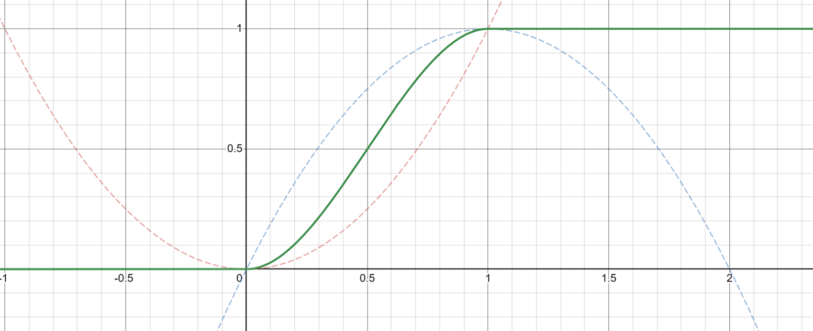

<a href="https://www.desmos.com/calculator?lang=zh-CN">desmos</a>在线曲线绘制工具

# Function

## mod

`mod(x, a)` 取余是一个周期函数，a 代表周期间隔，一般我们平移到中心分布，也就是 `mod(x, a) - a*.5`

## fract 

`fract(x) = x-floor(x)`，取小数部分是一个周期函数，等价于 `mod(x, 1)` 

## abs

取绝对值，是一个偶函数，一般用于镜像

# 插值

## 线性插值

两点之间就可以进行，`a + (b-a) * t`，t 是插值采样点

## cosine 插值

两点之间就可以进行，将 `cos` 函数的单调区间缩放，然后套在两个端点之间，也就是 `a + (b-a) * (.5 -.5 * cos(t * PI))`。本质上就是将 t 从 `[0-1]` 线性映射到了 `[0-1]` 非线性。因此，统一的非线性插值为 `a + (b-a) * f(t)`

## 拉格朗日插值

至少3个点进行插值，若只有两个点退化成线性插值。拉格朗日的插值曲线可以分解成一系列曲线，分解后的每条曲线只经过其中一个点，但是在其他点处的函数值都是零，这样叠加起来得到的曲线就会经过每一个点

# 开关函数

## smoothstep

首先定义两个非线性函数 $f_1 = x^2$ 和 $f_2 = 1-(x-1)^2$，然后进行线性插值，得到两端平滑的曲线

$$
m(x)=\left(1-x\right)\cdot f_1+x\cdot f_2=3x^{2}-2x^{3}
$$

然后对 x 限制在 0-1 之间 $k(x)=clamp(x,0,1)=\max\left(\min\left(x,1\right),0\right)$ 代入上式有 $m(x)=m(k(x))$，最终得到的曲线如下

进一步，控制 x 的区间，$t(x)=\frac{x-t_1}{t_2-t_1}$，最后代入有 $m(x)=m(k(t(x)))$

## smoothmin

在分界点 `a-b=0` 不是立马改变，而是给一个缓冲区域 `abs(a-b)<k` 进行过渡

过渡要保证函数零阶和一阶导连续

# 极坐标

将笛卡尔坐标系下的 uv 转成极坐标，在制作圆形图案时，能够带来一些便利 

## 最终效果

<canvas class="glslCanvas" data-fragment-url="./src/03-极坐标.frag" width="500" height="500"></canvas>

# SDF

点到几何表面的外部距离，对于一些直角方形几何（长方体、圆柱体）需要考虑内部距离，假设点到几何表面的向量为 `r`，则内部距离为 `min(maxcomp(r), 0)`，`maxcomp()` 代表向量的最大分量，最终的距离等于 `外部距离+内部距离`

- 当点位于内部时，`r<0`，`maxcomp(r)` 取的是离表面最近的距离是小于 0 的，min 不起作用，内部距离有效
- 当点位于外部时，`r>0`，`maxcomp(r)>0` 取 min 后为 `0` 因此内部距离无效