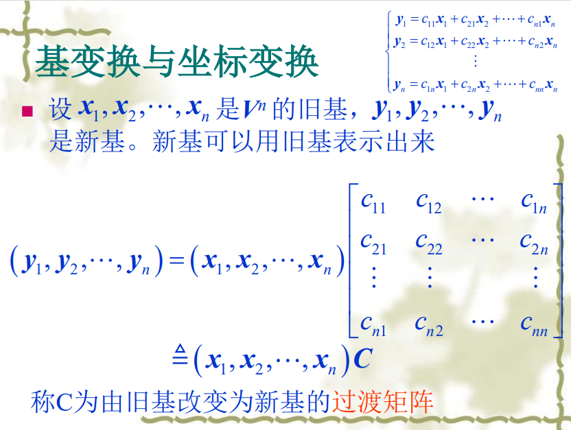
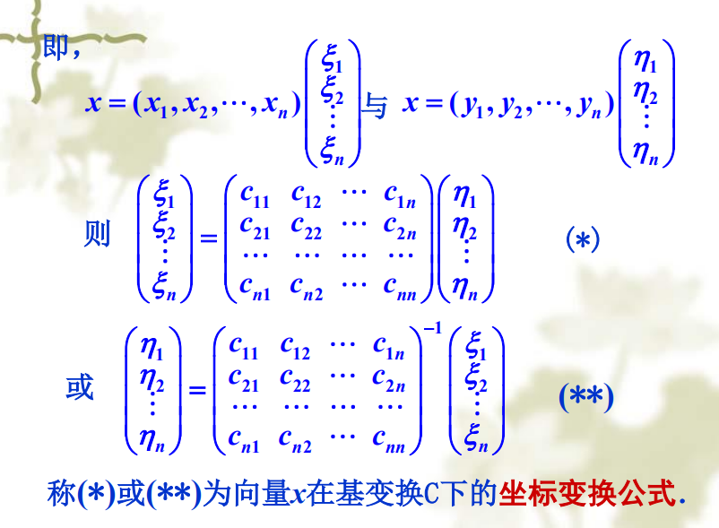
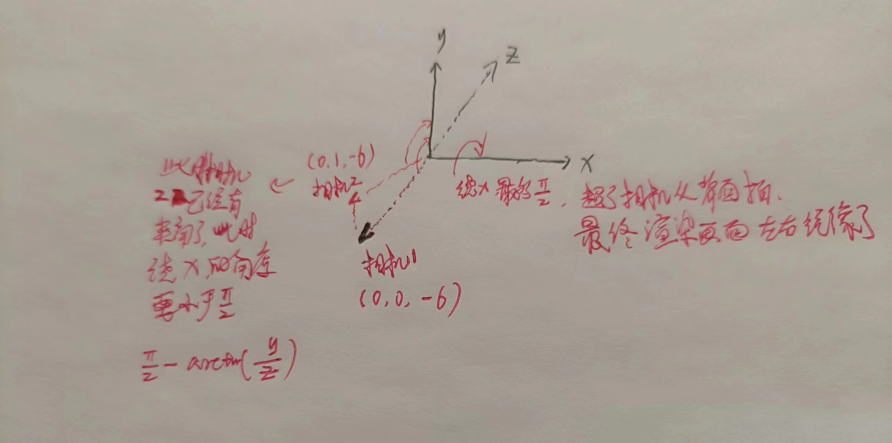

# 光照

`SDF` 的法线，就是场景表面的梯度，可以用差分近似

```glsl
vec3 GetNormal(vec3 p){
  vec2 e = vec2(.001, 0.);
  float d = GetDis(p);
  return normalize(   
    d - vec3(
      GetDis(p - e.xyy),
      GetDis(p - e.yxy),
      GetDis(p - e.yyx)
    )
  );
}
```

最后的 `return` 等价于 $normalize(f(p) - f(p-\Delta p))$，然后根据点乘计算漫反射即可，注意方向都需要归一化。同样你也可以去计算高光等

```glsl
float GetDifLight(vec3 p){
  vec3 lightPos = vec3(0., 5., 6.);  // 点光源放在正上方或者右上方
  lightPos.xz += vec2(cos(u_time), sin(u_time));  // 光源圆周运动

  vec3 n = GetNormal(p);
  vec3 l = normalize(lightPos - p);

  float dif = max(dot(l, n), 0.);

  return dif;
}
```

# 阴影

从射线终点，向光源进行 RayMarch，判断最终返回的步进距离是否小于终点到光源的距离，是的话，说明碰到了物体，则处在阴影中，此时需要对**漫反射强度衰减**，例如乘以一个很小的数

```glsl
float GetDifLight(vec3 p){
  // ...
  float d = RayMarch(p + n * MIN_DIS * 2., l);
  if( d < length(lightPos-p) ) dif*=.1;
  return dif;
}
```

那么这里的 `p + n * MIN_DIS * 2.` 是什么意思呢？因此我们的射线终点已经满足了 RayMarch 的停止条件，也就是离场景表面足够近了，那么这时我们直接拿终点再去 RayMarch 就会直接返回，因此我们将终点 <b>`沿着法线方向向外偏移一点`</b>，这样才可以继续步进

# 几何形状的过渡

用 `mix` 来混合 `SDF` ，以达到几何形状的过渡

```glsl
float GetDis(vec3 p){
  float sphere = sdSphere(p - vec3(0., 1., 6.), 1.); 
  float box = sdBox(p - vec3(0., 1., 6.), vec3(1., 1., 1.));
  
  float d = mix(sphere, box, sin(u_time)*.5+.5);  // 进行混合

  float ground = p.y;
  return min(d, ground);
}
```

# 相机模型

采用 `LookAt` 的模式来定义相机模型，参考我在<a href="https://www.zhihu.com/question/365603043/answer/3370775632">Unity LookAt 原理 —— 嘟嘟和</a>中的回答

这里我们需要注意的是 `uv` 坐标是在相机坐标系下的，而射线（起点和方向）都是在世界坐标系下的，因此我们需要找到**相机坐标系基**到**世界坐标系基** 的过渡矩阵。假设相机坐标系基是$y$，世界坐标系基是$x$，那么过渡矩阵定义如下



由于世界坐标系基是单位矩阵，因此过渡矩阵 **C** 就是 $(y_1, y_2, ..., y_n)$。而射线方向在相机坐标系基下的坐标是 $\eta=vec3(uv, z)$，其中 $z$ 代表了成像平面离相机的距离，必须大于 0，那么有坐标转换公式如下



也就是说，射线方向在世界坐标系基下的坐标是

$$
\xi = C\eta = (y_1, y_2, ..., y_n)
\left(
  \begin{array}{c}
	\eta_{1}\\
	\eta_{2}\\
	\vdots\\
	\eta_{n}
	\end{array}
\right) = \sum_{i} y_i * \eta_{i}
$$

那么相机坐标系基$y$如何求？就是通过 LookAt 的相机模型求解，代码如下

```glsl
vec3 LookAt(vec3 uv, vec3 ori, vec3 target, vec3 up) {
  vec3 z = normalize(target - ori),
      x = normalize(cross(up, z)),
      y = cross(z, x);
  // 上面三行就是在求相机坐标系的基
  vec3 i = uv.x*x + uv.y*y + uv.z*z, // 转到世界坐标系
  return normalize(i);
}
```

# 旋转相机

代码如下，需要注意的是相机的旋转都是绕原点转的

```glsl
vec2 ms = u_mouse / u_resolution;
vec3 ro = vec3(0., 0., -6.);
ro.yz *= rotate2D(-ms.y * PI * .49);
ro.xz *= rotate2D(ms.x * 2. * PI);
```

对于角度问题看如下图



<mark style="background-color:red;"> Question: 至于如何让相机围绕非原点旋转，这个我还不太会？</mark>

围绕非原点旋转的实现如下，也就是旋转一个 `偏移量=待旋转物体-旋转中心`，这样这个偏移量就是以旋转中心为原点的向量了，直接旋转偏移量，然后 `待旋转物体=旋转后偏移量+旋转中心`

```glsl
vec3 RotateAround(vec3 center, vec3 offset, vec2 ms){
  float maxYAngle = PI * .49 - (PI - atan(offset.y, offset.z));
  offset.yz *= rotate2D(-ms.y * maxYAngle);
  offset.xz *= rotate2D(ms.x * 2. * PI);
  return center + offset;
}
```

使用如下，假设相机 LookAt `vec3(0., 1., 6.)`，并且需要围绕 LookAt 点进行旋转，因为物体在 LookAt 点附近，这里设置相机相当于 LookAt 点的偏移量是 `vec3(0., 1., -4.)`，这里目前只支持偏移量 `y>0 & z<0`，也就是一开始相机位于 LookAt 的后上方

```glsl
vec3 ro = RotateAround(vec3(0., 1., 6.), vec3(0., 1., -4.), ms);
vec3 rd = LookAt(vec3(uv, .7), ro, vec3(0., 1., 6.), vec3(0., 1., 0.));
```

# 最终效果

<canvas class="glslCanvas" data-fragment-url="./src/04-阴影.frag" width="500" height="500"></canvas>
