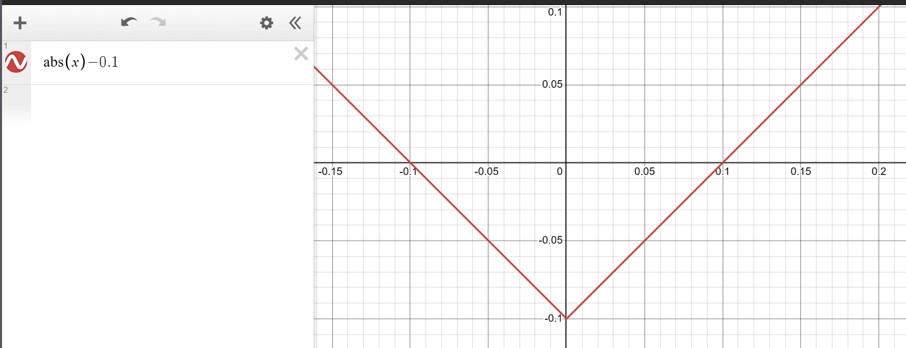

# 任意朝向的平面

射线终点 `点乘` 平面法向 + 截距 `d`，<mark>注意</mark>平面法向一定要归一化

```glsl
float plane = dot(p, normalize(vec3(1., 1., 1.))) + d;
```

这种任意朝向的平面可以用来裁剪物体，例如求交集 `max`。如下面的场景，我们有个正方体在 `vec3(0, 1, 6)` 处，同时我们对 box 进行了 `abs(box) - .1` 操作使其变成了一个有厚度的夹层。此时平面也刚好经过正方体的中心，然后求交集 `max`，就是去裁切该夹层



```glsl
float GetDis(vec3 p){
  float box = sdBox(p - vec3(0., 1., 6.), vec3(1.));
  float ground = dot(p, normalize(vec3(1., 1., 1.))) - 7./sqrt(3.);
  return max(abs(box) - 0.1, ground);
}
```

## 效果

<canvas class="glslCanvas" data-fragment-url="./src/05-技巧-平面裁切.frag" width="500" height="500"></canvas>

# 置换变换

只需要在最后得到的距离，通过射线终点 `p` 来修改偏移，这种偏移只适合一些小幅度不剧烈的偏移，否则会出现伪影

```glsl
vec3 bp = p - vec3(0., 1., 6.);  // 需要先拷贝一份
float box = sdBox(bp, vec3(1.)); 
box -= sin(bp.x*7.5+u_time*5.)*.02; // 置换变换是对距离进行操作
```

说白了，射线终点 `p` 可以看成是顶点，同样<mark>注意</mark>：操作前最好拷贝一份射线终点

```glsl
vec3 bp = p - vec3(0., 1., 6.);

// 缩放、旋转、镜像等变换是在计算距离之前
float scale = mix(1., 3., smoothstep(0., 1., bp.y));
bp.xz *= scale;

float box = sdBox(bp, vec3(1.)) / scale; 

// 置换变换是在计算距离之后
box -= sin(bp.x*7.5+u_time*5.)*.02/scale;
```

# 镜像变换

通过 `abs(p) - d` 来进行镜像，如下代码

```glsl
float GetDis(vec3 p){
  vec3 bp = p - vec3(0., 1., 6.);

  bp.xz = abs(bp.xz) - 1.5;  // xz 方向都进行镜像

  float scale = mix(1., 3., smoothstep(0., 1., bp.y));
  bp.xz *= scale;
  
  float box = sdBox(bp, vec3(1.)) / scale; 
  box -= sin(bp.x*7.5+u_time*5.)*.02/scale;

  float ground = dot(p, normalize(vec3(0., 1., 0.)));

  return min(box, ground);
}
```

## 效果

<canvas class="glslCanvas" data-fragment-url="./src/05-技巧-置换变换.frag" width="500" height="500"></canvas>

# 总结

变换顺序是 **平移 --> 镜像 --> 旋转 --> 缩放 --> 置换** 和实际对物体对象变换顺序是相反的