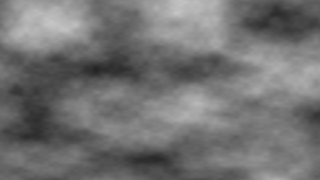
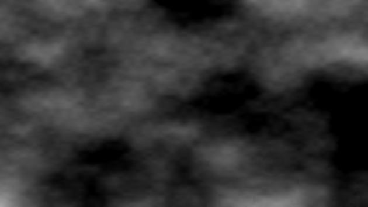
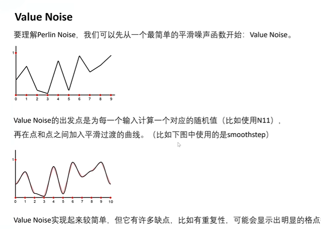
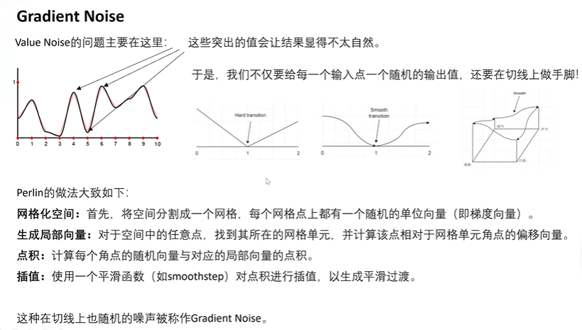
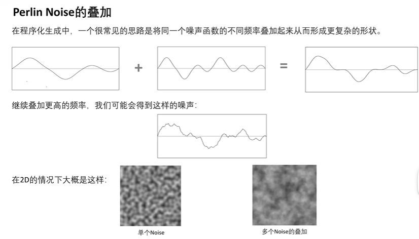

# 基本噪声

基本的噪声，包括 1D\2D\3D 等，其实现主要是通过大数取余来实现伪随机噪声，然后对 1D 噪声进行线性组合进而得到 2D 噪声

## N11

输入1维，输出1维噪声，实现如下，函数里面的常数，可以看出是随机种子 seed

```hlsl
float _N11(float s){
  return frac(sin(s*124583.3113+23.5463)*14375.5964);  // 返回的 0,1
}

float N11(float s){
  int xi = (int)floor(s * 4567.4567);
  xi = (xi << 13) ^ xi;
  return 1 - ((xi * (xi * xi * 15731 + 789221) + 1376312589) & 0x7fffffff) / 1073741824.0; // 返回的 -1,1
}
```

我们一般都会选择返回区间 `-1,1`，因此这样可以控制黑色部分的范围，可控性更高。例如下面通过简单变换将返回的 `0,1` 转换到 `-1,1`，然后通过 `abs() - d` 来控制黑色部分

```glsl
float N21(vec2 p) {
  return abs( 2. * fract(sin(p.x*131.13+p.y*6574.31231)*5641.3212) - 1. ) - .35;
}
```

|0,1|abs(-1,1)-d|
|---|---|
|||

## N21 

输入2维，输出1维噪声，那么可以对输入的2维分量进行线性组合得到1维输入到 N11 中即可

```glsl
float N21(vec2 p) {
  return N11(p.x*13.21+p.y*6574.);
}
```

## N22 

输入2维，输出2维噪声，那么可以对输入的2维分量进行两次的线性组合，分别将得到1维输入到 N11 中，然后将两次的结果组成一个2维向量返回即可

```hlsl
float2 N22(float2 s){
  float n = N11(s.x + s.y * 57.0);
  float m = N11(57.0 * s.x - s.y);
  return float2(n, m);
}
```

那么其实 N21 还可以借助 N22 来生成

```hlsl
float N21(float2 s){
  float2 r = N22(s);
  return 0.5*(r.x+r.y);
}
```

# Value Noise

这是一种更加符合自然界中的噪声，其做法如下

- 通过 `floor` 和 `frac` 网格化空间
- 为网格的四个点分别计算一个对应的随机值（例如使用 N11、N21）
- 对于网格内部的点，进行双线性插值得到其对应的随机值，注意这里的双线性插值可以使用双平滑插值替代

```glsl
float N21(vec2 p) {
  return fract(sin(p.x*131.13+p.y*6574.31231)*5641.3212);
}

float smoothValueNoise(vec2 uv)
{
  vec2 gv = fract(uv);
  gv = gv * gv * (3. - 2. * gv);
  vec2 id = floor(uv);
  float bl = N21(id);
  float br = N21(id + vec2(1., .0));
  float tl = N21(id + vec2(.0, 1.));
  float tr = N21(id + vec2(1., 1.));
  float b  = mix(bl, br, gv.x);
  float t  = mix(tl, tr, gv.x);
  float c  = mix(b, t, gv.y);
  return c;
}
```



但是这种 Value Noise 并不能保证网格点过渡切线的平滑，因此还需要在切线上做手脚，因此 Gradient Noise 就出来了

## Perlin Noise



```hlsl
fixed2 randVec(fixed2 value)
{
  fixed2 vec = fixed2(dot(value, fixed2(127.1, 337.1)), dot(value, fixed2(269.5, 183.3)));
  vec = -1 + 2 * frac(sin(vec) * 43758.5453123);
  return vec;
}

float perlinNoise(float2 uv, float scale)
{
  uv *= scale;
  float a, b, c, d;
  float x0 = floor(uv.x); 
  float x1 = ceil(uv.x); 
  float y0 = floor(uv.y); 
  float y1 = ceil(uv.y); 
  fixed2 pos = frac(uv);
  a = dot(randVec(fixed2(x0, y0)), pos - fixed2(0, 0));
  b = dot(randVec(fixed2(x0, y1)), pos - fixed2(0, 1));
  c = dot(randVec(fixed2(x1, y1)), pos - fixed2(1, 1));
  d = dot(randVec(fixed2(x1, y0)), pos - fixed2(1, 0));
  float2 st = 6 * pow(pos, 5) - 15 * pow(pos, 4) + 10 * pow(pos, 3);
  a = lerp(a, d, st.x);
  b = lerp(b, c, st.x);
  a = lerp(a, b, st.y);
  return a;
}
```

## 噪声叠加

噪声的叠加称之为 `turbulenceNoise`，中文翻译为 `湍流;动荡;(空气和水的)涡流;混乱;`



```glsl
float turbulenceNoise(vec2 uv, int n) // n 大约 5 即可了
{
  float c = 0.; // 累加
  float _f = 4.; // 初始频率，不建议设置太大，1 和 2 为好
  float _s = 1.; // 初始振幅
  float cs = 0.; // 累计振幅
  for(int i = 0; i < n; i++)
  {
    float l = pow(2., float(i));
    float f = _f * l;
    float s = _s / l;
    c += noise(uv * f) * s; // 这里可以是 smooth value noise 也可以是 perlin noise
    cs += s;
  }
  c /= cs;
  return c;
}
```

# Voronoi Noise

计算当前格子中的点到周围9个格子中的随机点的最小距离 <a href="https://www.shadertoy.com/view/4c3GD2">Demo</a>

```hlsl
float2 voronoi(float2 uv, float angleOffset, float cellDensity)
{
  float Out=0.0;
  float Cells=0.0;
  // cellDensity 其实就是 scale
  float2 g = floor(uv * cellDensity);  // 格子编号
  float2 f = frac(uv * cellDensity);  // 格子周期
  float t = 8.0;
  float3 res = float3(8.0, 0.0, 0.0);
  for (int y = -1; y <= 1; y++)
  {
    for (int x = -1; x <= 1; x++)
    {
      float2 lattice = float2(x, y); // 周围 9 个格点的 相对格点编号
      float2 dv = lattice + g;  // 周围 9 个格点的 全局编号
      float2 offset = float2(sin(dv.y * angleOffset), cos(dv.x * angleOffset)) * 0.5 + 0.5; // 固定偏移
      // float2 offset = sin(N22(dv)*angleOffset) * .5 + .5;  // 利用 N22 来进行随机偏移
      float d = distance(lattice + offset, f); // 计算当前格子内的点到周围 9 个格子内的随机点（相对格点编号+偏移）的距离，其实就是以当前格点做为原点
      if (d < res.x)
      {
        res = float3(d, offset.x, offset.y);
        Out = res.x;
        Cells = res.y;
      }
    }
  }
  return float2(Out, Cells);
}
```